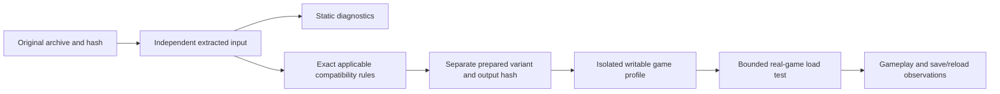

# Map compatibility preparation and testing

The Mac launcher prepares map data for Feral's Intel Mac game running under
Rosetta. It does not replace Rosetta, patch the game executable, or rewrite an
original downloaded archive. See [Engine map](ENGINE_MAP.md) for the current
reverse-engineering findings and their limits.

## Data flow

The existing `rules.py` and `variants.py` services already implement independent
prepared copies and exact input/output binding. A repair rule names its ID and
version, archive hash, game executable hash, provenance, rationale, and each
changed file's before/after hash. Repeating a rule is idempotent. A mismatch
stops preparation. Changes that affect gameplay must remain clearly labelled
compatibility editions with separate saves.

Static XML parsing is an early diagnostic step. It does not exercise the engine's
resource registries, merged stock definitions, terrain, scheduling or runtime
allocation. Packed-asset references and implicit train-car filename variants
need resolver-specific handling; naive file existence checks can produce false
alarms. A recent map or archive date does not establish Mac compatibility.

## Current investigation: loading allocation runaway

A Corn and Cattle: Nebraska Rails loading attempt on Feral build 222106.42031
remained running for about five minutes and reported roughly 94 GB physical
footprint. Its sampled game-thread stack repeatedly allocated memory in the
same code region found in preserved earlier loading-failure research. The exact
process was terminated and complete profile manifests were checked before and
after restoring Original Game. The map is locally recorded as Known issue.

All 15 XML files in the inspected package parse, and it contains loose assets,
not FPK containers. A blanket XML rewrite or FPK conversion is therefore not an
evidence-based response to this particular failure.

A narrower hypothesis concerns inherited industry definitions: the map reuses
stock industry identities but omits some goods those stock definitions consume.
The map's explicit production references resolve. If the Mac loader retains
stock production entries while applying overrides, unresolved inherited goods
could reach the allocation path. That merge behavior and causal chain remain
unproven. A separately labelled, exact-hash experiment appended the two stock
goods and their matching train cars, preserving all existing records. It also
failed: measured footprint rose from roughly 1 GiB at 30 seconds to 7.275 GiB at
34 seconds, crossing the monitor's 6 GiB threshold. The diagnostic sample taken
while stopping the process reported 8.5G and the same allocation path. The
monitor stopped only that experiment's process, and Original Game was restored
with both complete profiles preserved. This rules out treating that addition
as a sufficient repair. It does not establish the identity or origin of the
bad index. Subsequent decompilation traced that writer and the industry identity
lookup path; see the newer finding below.

## Newer finding: industry identity registry

The main executable builds numeric industry IDs from a fixed ordering table,
while its parsed definition collection can contain additional custom names.
Explicit custom placements can therefore create animated industry instances
whose numeric lookup returns `0xffffffff`. The animation grouping routine treats
that missing value as an unsigned index and grows its groups toward it. This
matches the sampled runaway allocation path; the exact failing runtime object's
name/value still needs capture or a controlled diagnostic edition.

A background scan found 121 of 222 local variants with explicit placements of
names outside that registry (120 of 221 unique imports). These are risk flags,
not confirmed crashes. A narrow candidate translator assigns unused recognized
internal IDs one-to-one and updates matching annex keys, preserving the original
archive and preparing an independent profile. Stock-field inheritance and
identity-specific behavior make this an experimental compatibility edition until
real-game tests establish its effect.

## Runtime testing design and gates

No supported headless scenario validator or pass/fail command-line interface has
been established for this build. An agent-driven GUI test has successfully loaded stock Southwest U.S. with no
AI opponents and quit normally in an isolated profile. The complete Original Game
profile manifest matched after restoration. Feral input recording produced a
file, but reliable replay remains unverified. Neither method is headless.

A runtime harness must:

1. Use a separately identified test variant with independent saves and settings.
2. Verify the stopped game, exact executable and active variant before launch.
3. Observe one exact process and process-start identity; never run games in parallel.
4. Apply explicit memory and time ceilings, preserve a diagnostic sample, and stop
   that exact process if a test exceeds its ceiling. A timeout is inconclusive
   loading evidence, not proof that a map can never work.
5. Prove the selected scenario reached the playable world. Process survival,
   a menu, or a loading screen is not a successful load.
6. Preserve logs, input/output hashes and test conditions, then restore the prior
   profile through the guarded transaction manager and verify save hashes.

The first controlled load must use a known-good baseline. Compare one change at
a time, including the unchanged failing map. Keep a loaded-map result distinct
from the six user-observed gameplay/save checks required for Verified. Never
mark a map Verified from a static report, replay exit code or short load test.

## Documented limits

The research includes whole-main-executable Ghidra analysis and a resumable
function export, with a partial interpretation of engine behavior. It is not
recovered original source or a complete model of the engine. No proprietary executable,
map payload, commercial asset, saved game or full disassembly belongs in this
repository. Local evidence can retain exact inputs privately. Public code and
documentation should contain original analysis, synthetic tests and recipes
that operate on the user's installed assets.

## Fast batch tooling

See [batch smoke tests](../scripts/research/BATCH_SMOKE.md) for the optional
sequential runner. It prints a plan by default, requires an explicit foreground
UI option for live tests, isolates diagnostic settings/saves, enforces bounds,
and restores the original profile after every attempt. Results resume only when
the exact inputs, game and test implementation match. The supplied visible UI
driver remains experimental until an end-to-end calibration passes.

Static scans can run while the user works. A real-game test using the supplied
driver needs the visible desktop and must run when the user is not using the
keyboard/mouse. No working headless mode is claimed.
