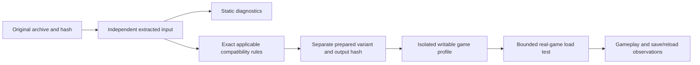

# Map compatibility preparation and testing

For the current corpus-wide findings, additional goods/car/annex failure paths,
and prioritized implementation gates, see the
[compatibility audit and implementation plan](COMPATIBILITY_AUDIT_PLAN.md).

The Mac launcher prepares map data for Feral's Intel Mac game running under
Rosetta. It does not replace Rosetta, patch the game executable, or rewrite an
original downloaded archive. See [Engine map](ENGINE_MAP.md) for the current
reverse-engineering findings and their limits.

## Data flow

The existing `rules.py` and `variants.py` services already implement independent
prepared copies and exact input/output binding. A repair rule names its ID and
version, archive hash, game executable hash, provenance, rationale, and each
changed file's before/after hash. Repeating a rule is idempotent. A mismatch
stops preparation. Changes that affect gameplay must remain clearly labelled
compatibility editions with separate saves.

Static XML parsing is an early diagnostic step. It does not exercise the engine's
resource registries, merged stock definitions, terrain, scheduling or runtime
allocation. Packed-asset references and implicit train-car filename variants
need resolver-specific handling; naive file existence checks can produce false
alarms. A recent map or archive date does not establish Mac compatibility.

## Current investigation: loading allocation runaway

A Corn and Cattle: Nebraska Rails loading attempt on Feral build 222106.42031
remained running for about five minutes and reported roughly 94 GB physical
footprint. Its sampled game-thread stack repeatedly allocated memory in the
same code region found in preserved earlier loading-failure research. The exact
process was terminated and complete profile manifests were checked before and
after restoring Original Game. The map is locally recorded as Known issue.

All 15 XML files in the inspected package parse, and it contains loose assets,
not FPK containers. A blanket XML rewrite or FPK conversion is therefore not an
evidence-based response to this particular failure.

A narrower hypothesis concerns inherited industry definitions: the map reuses
stock industry identities but omits some goods those stock definitions consume.
The map's explicit production references resolve. If the Mac loader retains
stock production entries while applying overrides, unresolved inherited goods
could reach the allocation path. That merge behavior and causal chain remain
unproven. A separately labelled, exact-hash experiment appended the two stock
goods and their matching train cars, preserving all existing records. It also
failed: measured footprint rose from roughly 1 GiB at 30 seconds to 7.275 GiB at
34 seconds, crossing the monitor's 6 GiB threshold. The diagnostic sample taken
while stopping the process reported 8.5G and the same allocation path. The
monitor stopped only that experiment's process, and Original Game was restored
with both complete profiles preserved. This rules out treating that addition
as a sufficient repair. It does not establish the identity or origin of the
bad index. Subsequent decompilation traced that writer and the industry identity
lookup path; see the newer finding below.

## Newer finding: industry identity registry

The main executable builds numeric industry IDs from a fixed ordering table,
while its parsed definition collection can contain additional custom names.
Explicit custom placements can therefore create animated industry instances
whose numeric lookup returns `0xffffffff`. The animation grouping routine treats
that missing value as an unsigned index and grows its groups toward it. This
matches the sampled runaway allocation path; the exact failing runtime object's
name/value still needs capture or a controlled diagnostic edition.

A background scan found 121 of 222 local variants with explicit placements of
names outside that registry (120 of 221 unique imports). These are risk flags,
not confirmed crashes. A narrow candidate translator assigns unused recognized
internal IDs one-to-one and updates matching annex keys, preserving the original
archive and preparing an independent profile. Stock-field inheritance and
identity-specific behavior make this an experimental compatibility edition until
real-game tests establish its effect.

### Controlled runtime observations

On the inspected game build, an original Great Lakes scenario exceeded a 6 GiB
physical-footprint ceiling during loading. A separate edition changing two
industry identifiers loaded in about 15 seconds with a peak of 1.29 GB. The
comparison retained all other map bytes, isolated saves, and restored the prior
profile after each run. This supports the identifier repair for this loading
failure; it does not establish equivalent gameplay or campaign reliability.

The Great Lakes edition also passed a source-launcher GUI sequence: Play Selected,
fresh scenario, manual save, normal quit, Play Selected again, named-save reload,
and continued simulation. A Corn and Cattle experimental edition passed that
sequence plus track construction and a train-selection screen. Both retain
experimental status. Train operation, cargo, bridges, objectives, era transitions,
and some substituted interface labels still need validation.

Chicago to the Rockies provides another controlled comparison: its original
exceeded the memory ceiling at 6.55 GB; a separate edition with two industry
identifiers and one derived annex identifier changed loaded in 20.3 seconds at
1.64 GB. All other source bytes were retained. An actual source-launcher sequence
then built a $28,000 track extension, opened the train route screen, autosaved,
manually saved, quit, relaunched and reloaded the named save. The track and
$472,000 balance persisted, and simulation continued to July 1851. Fresh and
reload peaks were 1.55 and 1.44 GB. Resource content and timestamps matched the
bounded-test receipts. This remains partial evidence: no operating route, cargo,
bridge, objective, era-transition or extended-play certification.

Thirteen selected original scenarios reached
the world in bounded automatic load tests. These are selected-sample load results,
not a compatibility rate for the full catalogue. Earlier OCR failures remain in
the attempt history; later successful runs provide separate positive evidence.
The current driver checks the exact scenario title before loading and money/date
HUD fields on two observations, with a bounded enlarged-image OCR fallback for
small text. Every batch requires a successful calibration matching the current
game, runner and driver.

A Canadian Pacific edition also passed bounded loading: 23.2 seconds and a
1.67 GB peak, versus the original reaching the memory ceiling at 6.54 GB.
The reviewed recipe changes eight industry identities, two derived annex keys,
and six typed ownership-goal references in three XML files. The original
388-file import remains unchanged. Independent review compared parsed scalars,
production, display/location vectors and icons, including the two aliases that
inherit stock records. Those two required no additional resets. This is loading
evidence only; stock aliases can still appear in interface text, and the edition
requires independent saves and further gameplay testing. Its source-launcher GUI
test subsequently passed fresh loading, autosaves, a named manual save, normal
quit, relaunch and named-save reload. After reloading, simulation advanced to
August 1892 and a $19,000 track extension was built. The named save predates that
extension, so this does not establish track persistence across reload. Fresh and
reload peaks were approximately 1.67 and 1.70 GB. Full gameplay remains unverified.

East Coast's separate edition changes four industry keys and one coupled annex
key in two XML files. Its bounded test reached the Williamsport scene in 20.0
seconds at 1.19 GB, compared with the original reaching the memory ceiling at
6.66 GB. The original 179-file import is unchanged. This edition has loading
evidence only; no save/reload or gameplay result is implied.

## Runtime testing design and gates

### Legacy model collision loading

Three independently bound loading crashes share a leading stack through
`NiCollisionData::SetSceneGraphObject`, `NiCollisionData::Initialize`, and the
legacy branch of `NiAVObject::LoadBinary`, reached while placing scenario
industries. Those packages contain byte-identical legacy `bank.nif` models.
The inspected branch packs low 32-bit pointer values and the initializer passes
them through the game's thunk-to-pointer conversion. The exact crash registers
and fault address agree with the resulting malformed scene-object pointer.
This establishes a defect in that inspected path; the crash report itself does
not identify the model filename.

A read-only scan of 221 original packages found 29 loose legacy NIF files in
22 packages, among 12,755 inspected NIF headers. The import report now checks
bounded headers and consistent text/binary versions, flagging versions below
5.0.0.19 for conversion review. That boundary comes from this engine's legacy
collision path. A header does not establish which conditional block executes;
packed files, resource precedence, geometry and controllers require deeper checks.
An unflagged version is not a compatibility certificate.

Any eventual conversion must preserve geometry, material/texture references,
animation and collision behavior in an independently prepared edition. A version
header rewrite alone is not a conversion. A legacy UV-count representation bug
in the private PyFFI reader initially prevented parsing the bank model. Correcting
that reader for the exact source version produced a byte-identical source round
trip. A separate structured conversion and independent binary reader then
compared geometry, materials, textures, transforms and explicit collision state.
The bank-only experimental edition reached the memory ceiling instead of the
original immediate crash. A separate edition combining that model conversion
with four audited industry identifiers and their ownership references then
loaded in about 17 seconds at 1.38 GB. It also passed actual source-launcher
fresh loading, autosave, manual save, normal quit, relaunch, named reload and
continued simulation. Peak footprints in that sequence were 1.40 and 1.43 GB.
Operational trains, cargo, bridges, objectives and extended play remain untested;
the edition stays Not verified. Static Oil/Power Plant dependency and custom-event
registration concerns remain. This exact-asset experiment does not authorize
blanket conversion of older models.

### Asset timestamps and reproducibility

Inspection of this build's file catalog shows that ordinary duplicate entries
replace an existing entry only when strictly newer; equal timestamps retain the
existing entry. Loose files and FPK members use this comparison, with FPK members
using their serialized member timestamps. Assets, CustomAssets and UserMaps
share the startup catalog. Separately added search managers have a different
priority mechanism.

A private synthetic reproduction confirms that the launcher's current content
manifest can remain unchanged while timestamps change the modeled winning asset.
The proposed live three-case comparison has not run. Existing successful tests
remain observations of their local installation; content hashes alone do not yet
establish identical resource selection after transfer. Compatibility preparation
and verification need to account for this metadata before portability is claimed.

The research batch runner now binds installed Assets and prepared map resources
to both content hashes and nanosecond modification times. It rechecks the source,
activated copy and stopped-game resources, retaining private receipts. Restoring
the original profile also checks resource metadata. The fingerprint implementation
itself participates in the test identity and calibration gate. Stock calibration
and a subsequent custom-map run have passed these integrity checks. Ordinary
gameplay records now capture the same resource metadata and invalidate a badge
when it changes. Historical checks remain readable, but success records without
resource metadata cannot earn Verified; historical issue warnings are retained.
This integration has synthetic regression coverage and a live source-GUI
readback of the current Chicago test record. Inspection-error paths have only
synthetic coverage; no live error was injected.
An optional bounded in-memory digest cache avoids repeated content reads while
still checking every path and file identity. New compiled recipes bind file
content and mtimes in their edition identity; old observations have not been
upgraded retroactively.

### Test gates

No supported headless scenario validator or pass/fail command-line interface has
been established for this build. An agent-driven GUI test has successfully loaded stock Southwest U.S. with no
AI opponents and quit normally in an isolated profile. The complete Original Game
profile manifest matched after restoration. Feral input recording produced a
file, but reliable replay remains unverified. Neither method is headless.

A runtime harness must:

1. Use a separately identified test variant with independent saves and settings.
2. Verify the stopped game, exact executable and active variant before launch.
3. Observe one exact process and process-start identity; never run games in parallel.
4. Apply explicit memory and time ceilings, preserve a diagnostic sample, and stop
   that exact process if a test exceeds its ceiling. A timeout is inconclusive
   loading evidence, not proof that a map can never work.
5. Prove the selected scenario reached the playable world. Process survival,
   a menu, or a loading screen is not a successful load.
6. Preserve logs, input/output hashes and test conditions, then restore the prior
   profile through the guarded transaction manager and verify save hashes.

The first controlled load must use a known-good baseline. Compare one change at
a time, including the unchanged failing map. Keep a loaded-map result distinct
from the six user-observed gameplay/save checks required for Verified. Never
mark a map Verified from a static report, replay exit code or short load test.

## Documented limits

The research includes whole-main-executable Ghidra analysis and a resumable
function export, with a partial interpretation of engine behavior. It is not
recovered original source or a complete model of the engine. No proprietary executable,
map payload, commercial asset, saved game or full disassembly belongs in this
repository. Local evidence can retain exact inputs privately. Public code and
documentation should contain original analysis, synthetic tests and recipes
that operate on the user's installed assets.

## Fast batch tooling

See [batch smoke tests](../scripts/research/BATCH_SMOKE.md) for the optional
sequential runner. It prints a plan by default, requires an explicit foreground
UI option for live tests, isolates diagnostic settings/saves, enforces bounds,
and restores the original profile after every attempt. Results resume only when
the exact inputs, game and test implementation match. The supplied visible UI
driver has passed end-to-end calibration on the development machine; it remains
experimental and requires a matching calibration before each new configuration
can run a batch.

A separate Africa Diamonds edition changed three internal identifiers after an
inheritance and reference audit. It loaded in about 16 seconds at 1.14 GB, while
the original exceeded the 6 GiB ceiling. That edition still needs gameplay and
save/reload testing. A separately audited Basin & Range Revision 2 edition also
loaded in about 20 seconds at 1.76 GB, compared with the original exceeding the
6 GiB ceiling. Corn and Cattle and Great Lakes experimental editions have passed
actual launcher load/save/relaunch/reload checks; full gameplay remains unverified.
The separate original Basin and Range package now also has a reviewed experimental
edition: five industry keys and three annex keys changed, with other source bytes
preserved. It loaded in about 19 seconds at 1.41 GB, versus the original reaching
6.50 GB. This is a load-only result, independent of the Revision 2 result.
Thirteen original scenarios have passed automatic fresh loading. These are
selected results across 227 original scenarios, most of which remain untested.
Broader original-map testing has also found memory-limit
failures and a crash matched to its exact process; a successful subset does not
establish general catalogue compatibility.

### Capacity constraint and feature preservation

Seven audited scenarios explicitly place more than 36 distinct industry types.
Counting only types with authored locations still exceeds the accepted registry;
these warnings are not merely unused stock definitions. Appalachia, for example,
requests 65 types at 88 locations during initialization, without an era filter.
An injective mapping of those identities into 36 accepted keys is impossible.

Merging types needs a separate equivalence proof. In Appalachia, otherwise similar
farms carry different fixed company names tied to coordinates. Reusing a definition
key overwrites earlier location/name lists. Concatenating lists instead randomizes
names across locations; shared IDs also change animation grouping, city duplicate
checks, and potentially ownership goals. Saves reconstruct stored internal names
against the current definitions, so rotating aliases between eras is not a proven
solution either.

Further review distinguishes runtime state from map authoring inputs. Industry
instances and saves retain production vectors and display names, but the examined
fresh-placement parser reads only coordinates, rotation, size and city attachment.
Creation copies the shared definition's complete production vector and randomly
chooses from its display-name pool. Saved instances still reconstruct models and
numeric identity through that shared definition. No supported per-placement
template override was found in the reviewed paths.

Central Mexico has 39 distinct placed production input/output sets even before
considering ratios and appearance. Combining those sets would add goods to the
merged businesses. WNYP offers a more subtle case: 43 keys form 36 explicit
payload groups when names and locations are excluded. However, its repeated
groups include ten separately buildable city businesses. Merging them into three
choices changes construction options and same-city coexistence. Neither example
supports a feature-preserving merge. These are format and behavior findings,
not additional runtime passes.

Those maps are blocked for the current injective translator. No feature-preserving
map-only representation has yet been demonstrated for them. This is a limitation
of the examined strategy and engine paths, not proof that every possible data
representation is impossible. Removing industries, suppressing their animations,
or splitting a campaign cannot be presented as equivalent compatibility.

Static scans can run while the user works. A real-game test using the supplied
driver needs the visible desktop and must run when the user is not using the
keyboard/mouse. No working headless mode is claimed.

## Launch preferences

Play on an imported map sets the game scenario selector to a scenario supplied
by that package. A valid previous selection is retained for packages with several
scenarios. Opening movies are skipped, and Quickstart is disabled because the
inspected game build routes that option to a fixed stock scenario. Players still
choose new-game options or Load Game in the game menu.

Only the writable custom profile's launch preferences are updated. Source
archives, frozen prepared editions, map assets, saves and Original Game settings
are preserved. Settings are validated before switching, written atomically under
the launch locks, and checked against their preimage before the game starts.
Scenario preselection does not certify the map's dependencies or gameplay.

### Explicit compatibility preparation API

`LauncherApplication.create_compatibility_edition(original, rules, label=...)`
prepares reviewed hash-bound rules as a separately labelled experimental edition.
It requires a current original catalogue record, the enrolled game build, matching
imported/prepared assets, and an explicit nonempty rule set. Preparation does not
activate the result, copy another edition's saves, or create gameplay verification.
Repeated preparation resolves to the same variant; retained saves are restored only
for that exact variant identity. A local receipt records parent/output identities,
rule versions, rationale, provenance and before/after file hashes without map bytes.

The generic rule API is infrastructure for reviewed repairs. Map Details offers
bundled named recipes through its Compatibility tab when the original map and
game identities match. No unreviewed name substitution runs during ordinary Play.

### Compiled recipe service (experimental API)

`compatibility_recipes.compile_identity_patch` constructs an exact full-file
patch in memory from the user's XML and reviewed typed operations. It edits
industry keys, depot keys or explicitly Industry-typed ownership references;
non-target byte ranges are copied without reserializing the document. Every
changed file needs exact input/output hashes. Reviewed descriptive occurrences
may remain unchanged, but a known identity/reference field cannot be classified
as descriptive text to bypass reference checks.

The version-2 compiler also accepts `ASCII` and `US-ASCII` declarations when
every input byte is ASCII. Numeric character references remain valid XML. It
preserves the declaration and all nonedited bytes; mislabeled non-ASCII bytes,
an ASCII declaration with a BOM, and other declared encodings are rejected.
The compiler version contributes to preparation identity. Existing editions and
their saves remain intact, while a preparation under a changed compiler contract
receives independent identity and requires its own runtime evidence.

A complete development-library encoding census covered 2,579 XML files across
221 original packages: 83 declared US-ASCII files were all ASCII-valid. Eight
other files failed strict decoding under their UTF-8 declaration or XML's
default UTF-8 interpretation. Encoding acceptance is a compiler precondition,
not a runtime compatibility result; no original file was re-encoded.

The supported subset rejects duplicate singleton identity fields and containers,
mixed-content or padded identity strings, unreviewed case-variant ownership
references, collisions, unexpected occurrence counts, namespaces and DTD/entity
declarations. These restrictions reflect inspected engine behavior: first-child
lookup, recursive text concatenation and significant nonempty text whitespace.
Unsupported forms require a separately reviewed operation; they are not silently
normalized. Private validation reproduced the existing reviewed Great Lakes
candidate bytes from its original import without changing the source.

`industry_registry.extract_supported_industry_registry` reads accepted identities
from the user's exact supported executable. The product API fixes the reviewed
build hash and table location, validates Mach-O bounds and rejects ambiguous
segment mappings. No complete game registry or map XML is bundled in these
modules. Research tools reuse the reader and bind its code hash in audit reports.

The optional `preserve-imported-resource-mtimes-v1` rule policy restores each
patched file's input mtime and verifies readback. It has a distinct rule
fingerprint; legacy fingerprints remain unchanged. Schema-4 recipe preparation
uses this policy and checks every output asset's hash, size and mtime against
its expected context. Recipe, compiler contract, original file inventory and
installed stock file inventory all contribute to the new edition identity.
Directory times and local absolute paths are excluded from this preparation
identity; the existing stricter runtime evidence fingerprint is unchanged.

`LauncherApplication.create_recipe_edition(original, recipe_id)` resolves a
bundled recipe under the application lock. The initial Great Lakes recipe
requires an exact retained archive, supported executable, complete imported
asset manifest, and unique matching loose-file readers. It rejects FPK providers,
stock identity collisions, unsupported flags and unhandled references. This is
a constrained supported case, not a general implementation of game resource
resolution. The compiler contract has an explicit version and works in frozen
applications without depending on source `.py` files at runtime.

The preparation receipt binds the compiled output and stock context. Activation
and ordinary Play reject changed resources or receipts; interrupted switches
are recovered before checking the selected edition. Independent saves belong to
the new identity. Repeating the same preparation may reuse only that identity's
saves. Exact output parity cannot carry an older edition's runtime or gameplay
evidence into this new identity. Map Details → Compatibility explains the changes and development test limits.
Create Compatibility Edition invokes the named API; it does not launch the game.
The completed edition is selected in Map Library and uses the ordinary Play flow.
Repeating creation selects the same edition with its saves. An unavailable recipe
is not a claim that the map cannot work; a menu candidate is not input validation.

### Additive dependency experiments

Rules may also carry reviewed, hash-bound asset additions. An addition is copied
into the disposable compatibility edition from a preserved donor import, with its
destination, payload hash, byte size and imported mtime recorded in the rule
descriptor. The rule rejects links, traversal, case-insensitive path overlap,
changed pre-existing targets and payloads over the normal bounded resource limit.
This keeps the original map and donor import unchanged while making the prepared
edition self-contained.

The first additive experiment targets Hill Valley Steaks' `Cowhide_Car` train
family. Static pre-cache analysis found 3,618 scenario train-car references;
1,365 have a complete loose version family, 553 have a missing versioned loose
file, and 705 have no matching loose base file (packed resources and embedded
references are not yet resolved). A preserved Side To Side 2 import contains the
exact reviewed v1/v2 KFM/NIF, dummy NIF, texture and icon family used to prepare
the Hill experiment. Preparation and identity checks pass, but the first bounded
launcher attempt stopped at `Orca get-app-state: permission_denied` before scene
evidence was established. It is therefore an automation failure, not a crash
result or a compatibility pass; the diagnostic recipe remains hidden from the
ordinary choices until a real fresh-load observation is captured.

The initial Great Lakes compiled edition has now passed a bounded fresh load and
an actual source-launcher GUI check: Play, fresh scenario, autosave, named manual
save, normal quit, Play again, named reload and continued simulation. Its new
identity has its own evidence; the older private experiment's evidence was not
transferred. Original profile contents and resource timestamps were verified on
restoration, and the new edition's saves were retained. This remains a partial
check: operational trains, cargo, bridges, goals, eras and extended play are
unverified, so the edition is still **Not verified** for gameplay.
