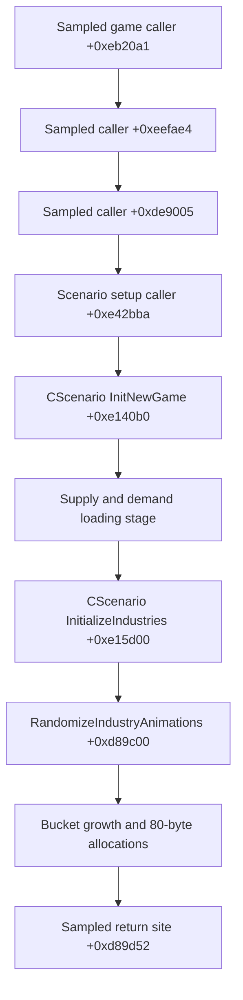

# Mac engine investigation map

This document records original analysis of the installed Mac game. Whole-main-
executable Ghidra analysis and a function-by-function pseudocode export support
a **partial engine map**; generated pseudocode is not original source. The purpose is to improve map diagnostics and develop narrowly
tested data compatibility editions without modifying the game executable.

## Build and method

| Item | Investigated value |
| --- | --- |
| Game | Feral Steam Mac Sid Meier's Railroads! |
| Version / build | 1.2 / 222106.42031 |
| Architecture | x86_64, running through Rosetta on Apple Silicon |
| Executable SHA256 | `981ca7180759d8578babf54cd9a4f76b93db503b33a7f1938c6b1427b95680f0` |
| Analysis date | 2026-10-04 |
| Methods | Read-only Mach-O inspection, strings, exported symbols, disassembly, Ghidra analysis, process samples, isolated runtime tests and map XML comparison |

Addresses below are **offsets from the executable's load base**, unless explicitly
labelled otherwise. They apply only to the executable hash above. Process samples
often show the instruction immediately after a call, rather than the callee's
entry point.

Initial command-line disassembly attached nearby symbols to broad ranges, which
was misleading. Ghidra recovered many retained class and method names, including
the actual industry routines below. Use analyzed function boundaries and exact
addresses rather than treating the nearest symbol as the callee. Descriptive
field names remain hypotheses unless linked to a specific writer and use.
No proprietary source, executable bytes or large disassembly extracts are included.

## Whole main executable export coverage

Ghidra 12.1.4 with JDK 21 completed main-executable analysis in 422 seconds.
The resumable export then visited every function discovered in that analyzed
program. Its completion marker and summary agree on:

| Inventory | Count |
| --- | ---: |
| Function entries, including external declarations | 64,728 |
| Successfully emitted pseudocode functions | 62,929 |
| External declarations with no implementation in this executable | 1,648 |
| Recorded function failures | 151 |
| Static references | 1,894,423 |
| Call-reference / unresolved-call entries | 374,047 |
| Recognized defined strings | 147,336 |
| References to recognized string starts | 78,151 |

Failures comprise 127 unreadable bodies, 19 varnode-hash errors, four type-size
errors and one function exceeding the 60-second retry limit. Ghidra also emitted
analysis warnings, including unresolved instruction constructors. A successful
pseudocode result can still be incomplete or misinterpreted; these counts are not
proof that every code byte, indirect target, type or behavior was recovered.

The first exporter pass stopped on an unreadable body. The exporter now records
that condition per function and continues; the resumed pass reused 62,926 verified
checkpoints and completed all index stages. The input was an independently hashed
copy. The installed game executable was not patched. Raw outputs and the Ghidra
project remain private; this repository contains the original exporter and our
analysis.

## Subsystem navigation

The private function inventory indexes the whole main executable. These entry
points give future investigations a starting place. They establish the presence
of classes and functions, not complete understanding of every subsystem. Offsets
in this table identify one indexed member near the start of each class region.

| Area | Indexed classes / starting offsets | Investigation state |
| --- | --- | --- |
| Scenario setup and load | `CScenarioSetup` `+0xe324f0`; `CScenario` `+0xe0cf10` | Load-stage call chain traced; full scenario semantics pending. |
| Industry definitions and animation grouping | `CIndustryFactory` `+0xd871e0`; `CIndustry` `+0xd7f550` | Name registry, failed lookup and allocation loop traced. |
| Trains and cars | `CTrainEngineFactory` `+0xea5cd0`; `CTrainCarFactory` `+0xe8e470` | Indexed; data compatibility semantics pending. |
| Terrain and terrain assets | `CTerrain` `+0xba16b0`; `CTerrainFactory` `+0xbb9e10` | Indexed; format/loading validation pending. |
| Saved games | `CSaveLoadManager` `+0xe09e70` | Indexed; existing launcher preserves saves without rewriting their format. |
| XML and packed-file loading | `CXmlReader` `+0xeb4110`; `FXml` `+0xedfd90`; `FPakFile` `+0xeddb50` | Indexed; complete resolution/precedence rules pending. |
| Feral virtual filesystem | `VFile` `+0x3263b0`; `CFeralVFSXMLBuilder` `+0x39a290` | Indexed; no unsupported external VFS override assumed. |
| Input and recording | `CFeralRecorder` `+0x2dbe30`; `CFeralEvent` `+0x354440` | Options traced; record file observed, replay did not reproduce menu navigation. |
| Rendering | `CMetalDevice` `+0x5c0100`; `CMetalThreadedCommandEncoder` `+0x5aab90` | Indexed; no headless renderer established. |
| Audio | `FAudioManager` `+0xf0d930`; `FAudioSystemMiles` `+0xf19d70` | Indexed; separate bundled Miles library outside main executable export. |
| Game events / networking | `CGameEvent_StartGame` `+0xd69850`; `FFileTransfer` `+0xeb52c0` | Indexed; no gameplay or network behavior changes. |

See [research export tooling](../scripts/research/README.md) for reproducible
private function, reference, call and string indexes. The main executable includes
both game code and substantial Feral wrapper/library code. Separately loaded
Miles, ChartDirector, Steam and Apple libraries are not included in its export.

## Evidence levels

- **Observed:** directly supported by the current executable, sample or XML.
- **Inferred:** a likely interpretation of those observations, not a recovered
  source-level declaration or runtime proof.
- **Unknown:** requires further tracing or a controlled test.

## Observed loading call path

A Corn & Cattle loading incident reached a sampled physical footprint of
**94.1G as reported by macOS sample**. Of 577 observations on the relevant sampled stack,
571 included return offset `+0xd89d52` above allocation code. This establishes a
runaway allocation symptom in that attempt; it does not identify the bad input.
Historical private reports independently recorded this same hot path in other
custom-map loading incidents.



The upper three nodes are known stack relationships with unresolved semantics.
The lower links also have static call-site support:

| Location | Observed behavior |
| --- | --- |
| `+0xe42bb5` | Calls the routine beginning at `+0xe140b0`; sampled return is `+0xe42bba`. |
| `+0xe147fc` through `+0xe1481b` | Uses the loading text “Tinkering with Supply and Demand”. |
| `+0xe14866` | Calls `+0xe15d00`; sampled return is `+0xe1486b`. |
| `+0xe15d86` through `+0xe15da4` | One branch calls `+0xd8a730`, then `+0xd89c00`. The latter is `CIndustryFactory::RandomizeIndustryAnimations`. |
| `+0xd89d48` through `+0xd89d52` | Requests 80 bytes from allocation code while preparing an inner bucket. |

This narrows the incident to a specific loading stage. It does not show that all
loading crashes share this cause, nor that bridge placement and this incident are
the same failure.

## Grouping routine: reconstructed behavior

The following pseudocode summarizes the grouping phase observed beginning at
`+0xd89c00`. It intentionally omits exception cleanup, vector capacity mechanics
and the later distribution calculations. Field names express offsets rather than
claiming recovered class definitions.

```text
build_groups(context):
    manager = global_manager
    groups = empty vector of pointer-vectors

    for i in 0 .. read_u16(manager + 0xaa) - 1:
        record = read_pointer_array(manager + 0xa0)[i]
        if record is null:
            continue
        if read_u32(record + 0x10) != 1:
            continue
        if read_pointer(read_pointer(record + 0x18) + 0x10) is null:
            continue

        bucket_id = read_u32(record + 0x14)

        while groups.size <= bucket_id:       # unsigned comparison
            old_size = groups.size
            grow groups by 10 entries
            for new_bucket in groups[old_size : groups.size]:
                reserve room for 10 pointers  # 10 * 8 = 80 bytes

        append record to groups[bucket_id]

    perform_later_distribution_work(context, groups)  # only partly mapped
    release temporary groups
```

### Field map

| Structure / offset | What is established | What remains unknown |
| --- | --- | --- |
| Global manager pointer | Referenced via unslid virtual address `0x10297e460`. | Full ownership/lifetime model. |
| Manager `+0xa0` | Pointer to an array of record pointers. | Complete object ownership/lifetime model. |
| Manager `+0xaa` | Unsigned 16-bit loop count. | How the count is populated from map data. |
| Record `+0x10` | Compared with integer `1` before grouping. | Full set of object type discriminators. |
| Record `+0x14` | Read as a 32-bit value and used as an unsigned bucket index. | Name lookup is traced below; actual value/name in the sampled failing process remains uncaptured. |
| Record `+0x18` | Pointer dereferenced before a nested `+0x10` pointer check. | Concrete relationship and ownership. |
| Outer group entry | 24-byte vector-like descriptor. | Exact original C++ typedef. |
| New inner group | Capacity of at least 10 pointer entries; observed allocation is 80 bytes. | Allocator overhead and total growth at any particular instant. |

The growth path does not show an application-level range check tying the index
to the number of valid map definitions. A very large index can require an enormous
number of buckets, each with its own small allocation. This explains **how this
code can consume huge memory despite individual allocations being only 80 bytes**.
Static analysis now shows a lookup miss explicitly writing `0xffffffff` into
this field. The failing process's actual object/name was not captured, so this
is a strong candidate cause rather than a complete runtime proof.

Ghidra identifies the grouping routine as
`CIndustryFactory::RandomizeIndustryAnimations() const`. The loading-stage text
places that call after supply/demand setup, but the function itself groups industry
animations.

### Industry identity lookup: traced mechanism

| Routine / offset | Established behavior |
| --- | --- |
| `LoadIndustries` `+0xd87980` | Parses base and scenario industry records by `szName`, then builds a separate numeric identity registry from a fixed 36-name table. |
| `PlaceScenarioIndustries` `+0xd8a730` | Walks parsed definitions and their explicit locations, including definitions absent from that numeric registry. |
| `CreateIndustry` `+0xd88d00` | Creates a type-1 object from a parsed definition and stores the supplied name at object `+0x28`. |
| `ConstructObject` `+0xd890a0` | Looks up that name in the numeric registry; a miss writes `0xffffffff` into object `+0x14` at `+0xd895d1`. |
| `Initialize` `+0xd88a70` | Has a second index-assignment path with the same missing-value behavior; write at `+0xd88bb8`. |
| `RandomizeIndustryAnimations` `+0xd89c00` | Uses that unsigned index to grow animation groups without first rejecting the missing-value sentinel. |

The numeric registry is factory `+0xc8`; parsed definitions are factory `+0xa0`.
`LoadIndustries` iterates 36 entries of `_PCOrderIndustryNames` at unslid address
`0x1018ce910`. It looks each name up in the parsed definitions and assigns accepted
entries dense numeric IDs. No custom-name append pass was found in this routine.
Definitions and the numeric registry are therefore different collections.

Original explanatory pseudocode:

```text
parse base and scenario definitions keyed by industry name
for name in the fixed ordering table:
    if its definition is accepted:
        numeric_ids[name] = next_index()
for definition in parsed_definitions:
    for location in definition.explicit_locations:
        instance = create_industry(definition, location)
        instance.animation_group = numeric_ids.lookup_or_missing(definition.name)
for instance in animated_industries:
    while groups.size <= unsigned(instance.animation_group):
        append_ten_groups_and_reserve_each_group()
```

The animation-related entity pointer is an additional runtime condition. A name
outside the table alone is not proof that every map containing it will crash.

The inspected Corn and Cattle source has 25 industry identities: three match the
registry and 22 do not, with 52 explicit placements among the latter. One mismatch
is spelling/spacing (`Lumbermill` versus `Lumber Mill`); others are custom types.
A read-only scan of 222 local variants found 132 with outside-registry definitions
and 121 with explicit placements of them. Ten variants had unresolved scenario
references, including seven with XML parse errors. These are **static risk
findings**, with zero runtime passes implied by the scan.

### Map-only translation candidate

An experimental translator can assign unsupported internal identities to unused
recognized identities with a one-to-one mapping, then update exact industry and
matching annex key nodes. Original display names, goods, production, models,
locations, terrain and source archives should remain intact. This is a candidate,
not an established repair. It needs a separate profile and fresh saves.

Reusing a stock key can inherit fields omitted by a custom definition. Present
`Production/Resource`, `DisplayNames/szDisplayName` and `Locations/Location`
sequences replace previous vectors, but an empty container does not necessarily
clear them. Scalar/string defaults, identity-specific behavior, in-city versus
rural use and UI labels require separate checks. Do not describe aliasing as
behavior-preserving until those checks and real-game testing pass.

### Earlier inherited-goods hypothesis

The inspected Corn & Cattle package has 15 well-formed loose XML files and no FPK
containers. Its explicit production-good, in-city and rural annex references
resolve under the checks performed. XML syntax alone therefore does not explain
this incident.

Some custom definitions reuse stock industry names while changing production
goods. The installed stock definitions for several reused names refer to goods
absent from the custom goods list. A working comparison map did not exhibit the
same missing inherited-good pattern among the industries checked.

**Hypothesis:** the Mac loader may retain or merge some stock industry resources,
creating a lookup absent from the custom goods definitions. The actual inheritance
behavior, the connection to the bucket index and causality remain unproved. The
separately labelled experiment below tested that proposal and failed. Later parser
analysis also shows that Corn's present production records replace inherited
production vectors, weakening this explanation.

### Result of the inherited-goods experiment

The exact-hash experimental edition appended the two missing stock goods and
matching train cars while preserving existing records. A user fresh-scenario
load still entered the same allocation loop. The memory observer saw 7.275 GiB
at about 34 seconds; the one-second diagnostic sample reported 8.5G while the
observer stopped the exact process. Original Game and both profile manifests
were preserved through recovery. This experiment is **Known issue**, not a
repair. Do not repeat it or stack additional unrelated changes on it. The
index writer has since been traced as described above; its actual failing runtime
value/name remains uncaptured.

## Command-line and recorder map

The bundled Feral Advanced settings UI exposes `GameCommandLine` and
`GameCommandLineEnabled`. Static analysis also establishes code-referenced
`-record` and `-replay` options. Recording has now been tested in an isolated stock-game profile. The game
wrote 2,041 input events during a successful Southwest U.S. load and normal
quit. Replay is under investigation; a recording file alone does not establish
reproducible playback.

### Argument parser

| Offset | Observed role |
| --- | --- |
| `+0xb3cb0` | Splits a stored option using an equals-sign delimiter and normalizes leading hyphens. |
| `+0x28cbf8` | Initializes the delimiter object from the literal `=`. |
| `+0xb3dd0` | Searches for a matching option with exactly two parsed components, returning the second. |
| `+0xb3ff0` | Converts that value to a path; an absolute slash-prefixed path is retained, while a relative path is prefixed with the current directory. |
| `+0x2dc040` | Tests the recording/replay options and stores mode flags and their paths. |

The strongest statically supported candidate syntax is a **single argument per
option**:

```text
-record=/absolute/private/path/recording.json
-replay=/absolute/private/path/recording.json
```

Use separate launches for recording and replay. An explicit absolute path without
spaces or equals signs avoids additional quoting/parser uncertainty. A bare
`-record` takes a fallback that constructs a dated JSON filename; a bare `-replay`
uses `RecordingLogfile.json` in a base location that has not been fully resolved.
Explicit paths are preferable for a controlled test.

### Recorder consumer

Reconstructed control flow:

```text
if option_present("record"):
    path = option_path("record")
    if path is empty:
        path = generated_timestamped_log_path()
    recording_enabled = true
    recording_path = path

if option_present("replay"):
    path = option_path("replay")
    if path is empty:
        path = default_base / "RecordingLogfile.json"
    replay_enabled = true
    replay_path = path
```

Runtime type information and recorder vocabulary include raw keyboard/mouse input,
controller events, synchronization points, screenshots and JSON records. These
support investigating **GUI input replay**. They do not establish a headless
scenario loader, a deterministic campaign simulator or a map-validation API.

`LastScenarioName` is referenced by settings serialization alongside year,
difficulty and AI-count settings. That is not evidence of direct scenario launch.
`Quickstart` is a real alternate startup branch, but is not an established
arbitrary-map launch option. `CSettings::Read` (`+0xe4c270`) reads it;
`CMainMenuState::Begin` (`+0xda0ae0`) uses a separate `CRRTycoon +0x120` scenario
path, initialized by the constructor (`+0xde76d0`) to the stock Northeast
scenario. `LastScenarioName` is stored separately and controls menu selection.
Quickstart enters staging/session-host code; automatic completion and operation
without a visible window remain unverified.

The only `isHeadless` selector found is adjacent to Metal device properties:
Apple documents it as a GPU display-connection property, not a game execution
mode. [Apple Metal documentation](https://developer.apple.com/documentation/metal/mtldevice/isheadless)

The official Steam-hosted Mac manual describes starting through the pre-game
window and selecting a scenario in the game's menus. Its text contains no
headless, command-line or replay instructions. Absence from that manual does not
prove an internal facility is impossible.
[Mac manual](https://shared.fastly.steamstatic.com/store_item_assets/steam/apps/7600/manuals/Manual_EN_STM.pdf?t=1568915755)

## Automated runtime testing

An agent-driven GUI smoke test loaded the stock **Southwest U.S.** scenario with
zero AI opponents, confirmed the playable world and scenario introduction, then
quit normally. An isolated profile held all test settings and saves. The original
profile's complete manifest matched after restoration. This proves a real game
load can be tested without requiring the user to perform the menu sequence; it
is not extended gameplay or save/reload verification.

The startup sequence must handle Feral's pregame **Play** button, skip opening
animations, and positively identify the main menu before selecting a scenario.
The game's `Settings.ini` contains `SkipOpeningMovies`; test its effect only in
an isolated diagnostic profile before relying on it. A watchdog starts at process
creation, so time spent in the pregame window counts against its ceiling.

The emitted input recording is JSON-like, with bare `+infinity` and `nan` values.
All observed mouse-button records have nonfinite absolute coordinates. Preserve
the exact original recording when investigating playback; a sanitized inspection
copy must not silently replace it. These observations make blind coordinate
replay an unproven test method.

For every run, retain the exact executable/map identity, starting profile,
scenario settings, memory/time trace, screenshots and outcome. Process survival
or a clean exit is not sufficient: observe the expected playable scene. A timeout
at a menu is a harness failure, distinct from a scenario load failure. Restore the
prior profile through the transaction manager and compare its complete manifest.

The inherited-goods experiment has already failed; do not rerun it as a proposed
repair. The next diagnostic edition should test the directly traced industry-ID
lookup mechanism with exact changes and clearly labelled behavioral risks.

## Unmapped work

- The bad index's actual runtime value and whether the cause is a missing lookup,
  definition merging, damaged input or another mechanism.
- Complete XML precedence and stock/custom override rules.
- The later supply/demand distribution calculations and their additional failure
  paths.
- Reliable recorder playback and its handling of nonfinite mouse coordinates.
  Record-mode launch argument forwarding and file creation are observed.
- Any genuine headless/no-render scenario execution facility.

This map should grow through reproducible observations. Finding a callable path
or obtaining one successful load is not proof that a complete custom scenario is
reliable.
